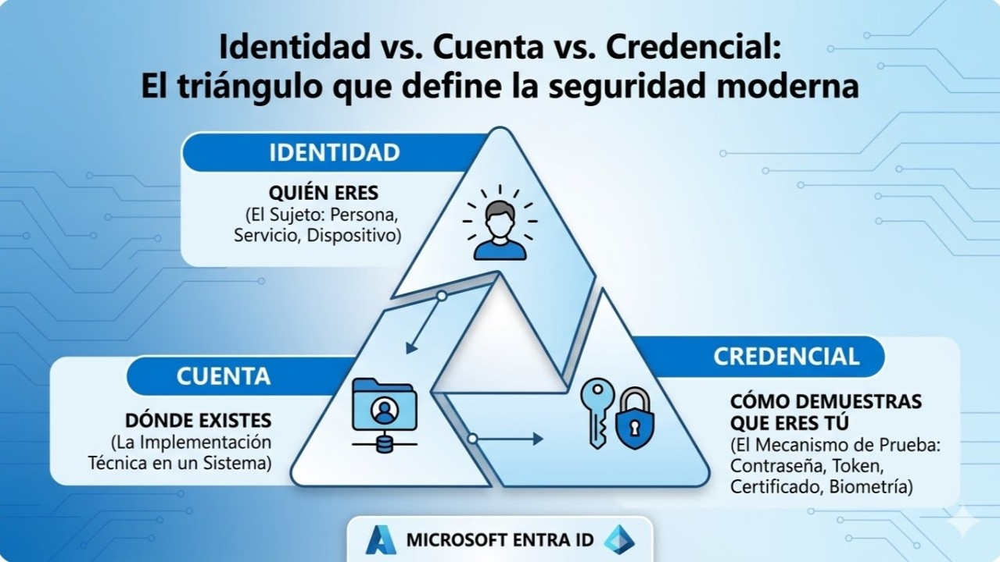

# Identidad vs. cuenta vs. credencial: el triángulo que define la seguridad moderna

Este artículo explica, desde una perspectiva arquitectónica, la diferencia entre identidad, cuenta y credencial. Aunque suelen usarse como sinónimos, representan conceptos distintos que afectan directamente al diseño de seguridad, acceso, gobernanza y cumplimiento en cualquier arquitectura cloud.

Comprender esta separación conceptual es clave para diseñar entornos seguros, escalables y gobernables, especialmente cuando se integran múltiples sistemas, proveedores y dominios.

En seguridad, las palabras importan. Confundir identidad, cuenta y credencial lleva a errores de diseño que se traducen en accesos incorrectos, privilegios excesivos, auditorías incompletas y arquitecturas difíciles de gobernar.

Un arquitecto no piensa en usuarios, sino en entidades, representaciones y mecanismos de autenticación. Ese es el verdadero modelo mental.

## 1. Identidad: quién eres en el sistema

La identidad es el concepto más abstracto y más importante. Es la representación de una entidad dentro de un sistema: una persona, un servicio, un dispositivo o una aplicación.

**Una identidad define quién eres, no cómo accedes.**

Características clave:

- Es única dentro del dominio.
- No depende de una contraseña o token.
- Puede existir sin credenciales activas.
- Tiene atributos, roles, políticas y relaciones.

La identidad es el sujeto en un modelo de seguridad. Todo lo demás gira alrededor de ella.

## 2. Cuenta: la implementación de la identidad en un sistema

La cuenta es la materialización técnica de una identidad dentro de un sistema específico. Mientras la identidad es conceptual, la cuenta es operativa.

Ejemplos:

- Una identidad humana puede tener una cuenta en Azure AD.
- Una identidad de servicio puede tener una cuenta administrada.
- Una identidad externa puede tener una cuenta federada.

La cuenta define:

- dónde existe la identidad,
- cómo se gestiona,
- qué políticas se le aplican,
- y qué recursos puede ver o administrar.

Una identidad puede tener múltiples cuentas en distintos sistemas, pero todas representan al mismo sujeto.

## 3. Credencial: el mecanismo que prueba que eres quien dices ser

La credencial es el elemento más concreto y más frágil del modelo. Es el mecanismo que permite demostrar la identidad.

Ejemplos:

- contraseña
- certificado
- token
- clave privada
- secreto de aplicación
- autenticación biométrica
- llave FIDO2

La credencial no es la identidad. La credencial no es la cuenta. La credencial es solo la prueba. Y como toda prueba, puede expirar, revocarse, rotarse o comprometerse.

Un diseño maduro minimiza el uso de credenciales estáticas y favorece mecanismos modernos como autenticación sin contraseña, tokens de corta duración y claves administradas.

## Cómo se relacionan: el modelo arquitectónico correcto

La forma más clara de entenderlo es esta:

- **Identidad → quién eres**
- **Cuenta → dónde existes**
- **Credencial → cómo demuestras que eres tú**

Cuando estos tres conceptos se mezclan, aparecen problemas como:

- privilegios excesivos
- accesos no auditables
- credenciales huérfanas
- identidades sin dueño
- cuentas sin propósito
- fallos de gobernanza

Cuando se separan correctamente, la arquitectura se vuelve más segura, más gobernable y más fácil de automatizar.

## Managed Identities: la cuenta recomendada para aplicaciones

En aplicaciones cloud, la mejor implementacion de cuenta para un workload es una Managed Identity. Este patron evita secretos estaticos y traslada la autenticacion al plano de identidad de la plataforma.

### Por que mejora la arquitectura

- Elimina client secrets persistentes en codigo y archivos de configuracion.
- Permite rotacion automatica de credenciales administradas por plataforma.
- Facilita auditoria de acceso por identidad real de servicio.

### Secretless por diseno

Una arquitectura secretless reduce la superficie de exposicion porque no depende de contrasenas reutilizables ni llaves incrustadas.

Flujo recomendado:

1. La aplicacion obtiene token mediante Managed Identity.
2. El acceso a recursos se controla con RBAC de minimo privilegio.
3. Key Vault, Storage y APIs aceptan identidad administrada sin secretos en texto plano.

### Relacion con Zero Trust

Managed Identity operationaliza Zero Trust porque toda solicitud se verifica por identidad, contexto y autorizacion explicita, en lugar de confiar en la red o en secretos de larga vida.

## Conclusión

Identidad, cuenta y credencial no son sinónimos: son capas distintas de un mismo modelo. La identidad define al sujeto, la cuenta lo representa en un sistema y la credencial demuestra que es quien dice ser.

Cuando un arquitecto entiende esta separación, puede diseñar políticas coherentes, accesos mínimos, automatización segura y gobernanza real. La seguridad no empieza en las herramientas: empieza en el modelo mental.